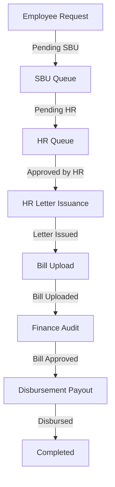

# RITES - Executive Health Checkup (EHC) Portal

A premium, fully interactive administrative portal designed for **RITES Limited** (A Government of India Enterprise) to manage end-to-end Executive Health Checkup requests, referrals, billing, and disbursements.

---


When you open the portal, the **Employee No. (`10124`)**, **Employee Name (`ANJANI UPADHYAY`)**, and associated division/designation fields are pre-populated by design. 

This is a standard pattern for **interactive demonstration/evaluation builds**:
* **Instant Evaluation**: It ensures you do not have to guess or manually construct employee records, department structures, or family dependent lists just to test the submission flow.
* **Database Mock Reference**: The application matches this default ID against the mock databases initialized in `api.js` (which holds pre-configured dependents, ages, and eligibility rules) to demonstrate dynamic age calculations and green/red eligibility tags out of the box.
* **Testing custom records**: You can clear or change these inputs to try other pre-configured mock employee numbers:

| Emp No | Name | Designation | Division | Dependents |
|--------|------|-------------|----------|------------|
| `10124` | ANJANI UPADHYAY | Manager (IT) | Information Technology | Self, Spouse |
| `10245` | RAHUL KUMAR | Assistant Manager | Civil Engineering | Self, Spouse, Father |
| `10312` | SUNITA VERMA | Dy. General Manager | Human Resources | Self, Spouse, Daughter |
| `10378` | ARUN SHARMA | Executive Engineer | Electrical Engineering | Self, Spouse, Father, Mother |
| `10445` | PREETI SINGH | Sr. Finance Officer | Finance & Accounts | Self, Spouse |

---

## File Architecture & System Design

The frontend codebase is modular, lightweight, and structured to run completely in client-side browsers without mandatory complex backend dependencies:

1. **`index.html`**
   * Handles the single-page application (SPA) layout.
   * Houses the Left Navigation Sidebar and the main views.
   * Implements custom data views including the SBU queue, HR referral generator, Bill Uploader, and Finance payout sheets.

2. **`styles.css`**
   * Custom CSS variables for color tokens (RITES Green, Slate Slate, Primary Blue).
   * Houses custom cards, interactive tables, validation error indicators, and fade-in route transitions.

3. **`api.js`**
   * Configures the active mode: **Demo Mode** (simulated state changes saved locally via browser `localStorage`) or **Live Mode** (connects to an active REST API).
   * Defines default mock databases for hospitals, cities, configuration, and employees.
   * Exposes asynchronous methods to update rates, upload checkup bills, log audits, and process disbursements.

4. **`app.js`**
   * Serves as the UI controller logic.
   * Implements frontend pagination, local search, dynamic city-state dropdown dependencies, and state-transition submission events.

---

## End-to-End Workflow Guide

Follow this sequence to test the entire lifecycle of an EHC request:



1. **Submit Request**: Open **Health Checkup Request**, select a hospital and choose eligible dependents. Click *Submit*.
2. **SBU Authorization**: Go to **SBU Queue**, select the pending EHC claim, write remarks, and click *Approve*.
3. **HR Validation**: Open **HR Queue** (under ADMIN/HR menu), inspect the request details, write comments, and click *Approve*.
4. **Issue Referral Letter**: Go to **Issue Letter** (under HR), click *View & Issue Letter*, inspect the generated RITES referral letter, and click *Confirm & Issue Letter*.
5. **Upload Checkup Bill**: Navigate to **Upload Bill** (under HR), select the letter, fill in invoice numbers and amounts, and click *Submit*.
6. **Finance Invoice Audit**: Open **Finance Bill Approvals**, select *Audit & Process*, write auditing remarks, and click *Approve Bill*.
7. **Disburse Payout**: Open **Prepare Bill**, select claims, enter NEFT/RTGS UTR transaction codes, and click *Generate Payout*.

---

## How to Run the Frontend

1. **Option A (Double-Click)**: Simply double-click the `index.html` file in your file explorer to open it directly in Google Chrome, Microsoft Edge, or Firefox.
2. **Option B (Local Web Server)**: Run a local server in the project folder to emulate HTTP headers:
   ```bash
   # Using Node.js http-server
   npx http-server -p 8005
   
   # Or using Python 3
   python -m http-server 8005
   ```
   Then navigate to: `http://localhost:8005/`
